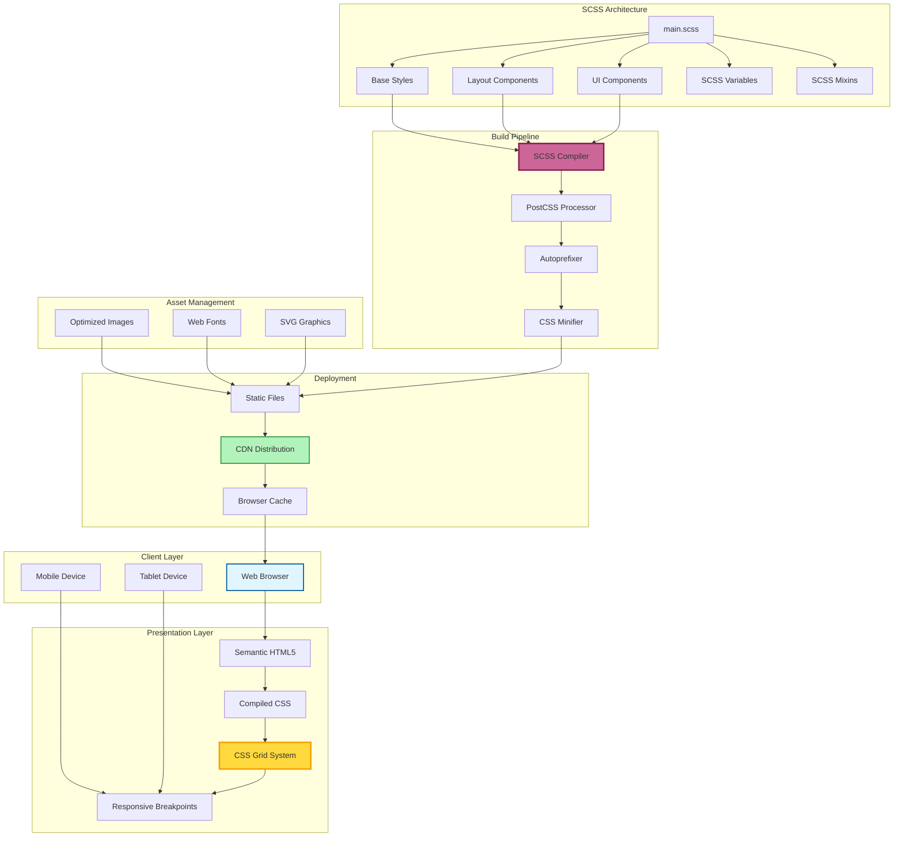
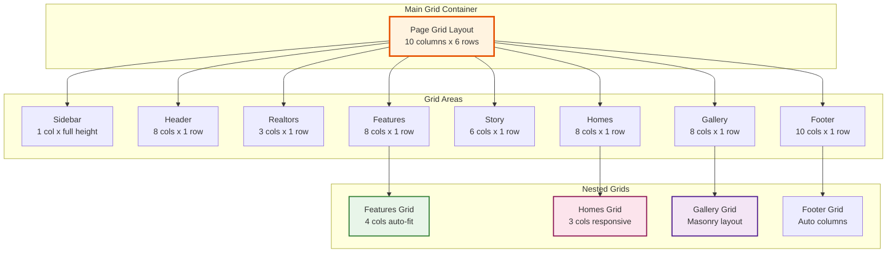
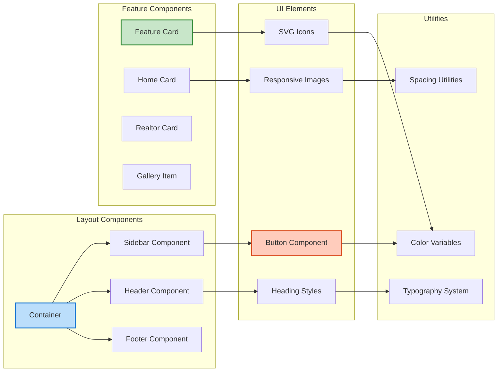
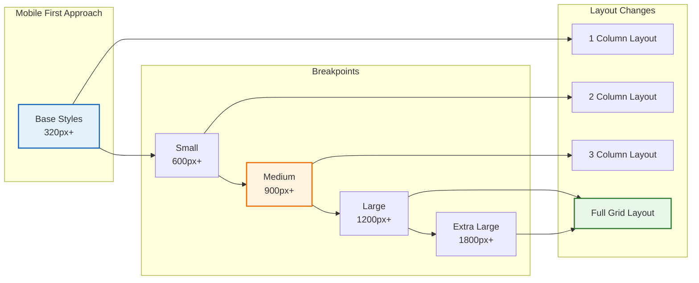
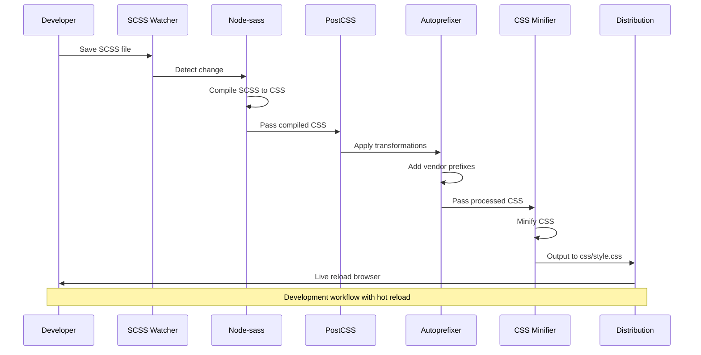
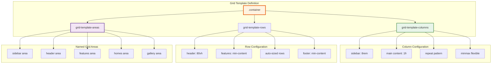
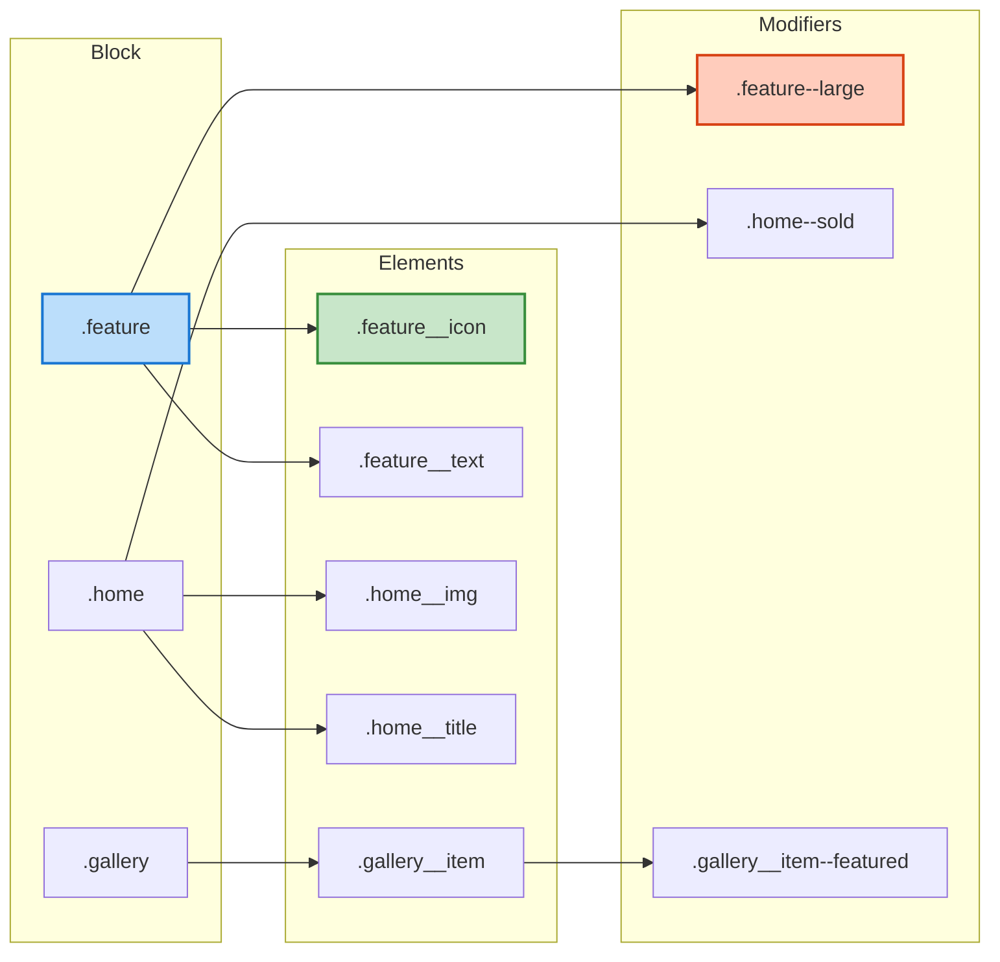

# Nexter - System Architecture

## Overview
A modern real estate landing page demonstrating advanced CSS Grid layouts, Flexbox, and responsive design patterns built with SCSS architecture and BEM methodology.

## Architecture Diagram

## CSS Grid Layout System

## Component Architecture

## SCSS File Structure

```mermaid
graph TB
    subgraph "Main Entry Point"
        MainSCSS[main.scss]
    end

    subgraph "Base Layer"
        Reset[_reset.scss]
        BaseStyles[_base.scss]
        TypographyBase[_typography.scss]
        Utilities[_utilities.scss]
    end

    subgraph "Abstracts"
        VariablesFile[_variables.scss]
        MixinsFile[_mixins.scss]
        Functions[_functions.scss]
    end

    subgraph "Layout"
        GridLayout[_grid.scss]
        SidebarLayout[_sidebar.scss]
        HeaderLayout[_header.scss]
        FooterLayout[_footer.scss]
    end

    subgraph "Components"
        Features[_features.scss]
        Homes[_homes.scss]
        Gallery[_gallery.scss]
        Realtors[_realtors.scss]
        Story[_story.scss]
    end

    MainSCSS --> Reset
    MainSCSS --> BaseStyles
    MainSCSS --> TypographyBase
    MainSCSS --> Utilities

    MainSCSS --> VariablesFile
    MainSCSS --> MixinsFile
    MainSCSS --> Functions

    MainSCSS --> GridLayout
    MainSCSS --> SidebarLayout
    MainSCSS --> HeaderLayout
    MainSCSS --> FooterLayout

    MainSCSS --> Features
    MainSCSS --> Homes
    MainSCSS --> Gallery
    MainSCSS --> Realtors
    MainSCSS --> Story

    style MainSCSS fill:#cc6699,stroke:#8b2252,stroke-width:3px
    style VariablesFile fill:#fff3e0,stroke:#e65100,stroke-width:2px
    style GridLayout fill:#e8f5e9,stroke:#2e7d32,stroke-width:2px
```

## Responsive Design Breakpoints

## Build Process

## Grid Template Implementation

## BEM Methodology Implementation

## Technology Stack

### Core Technologies
- **HTML5**: Semantic markup
- **CSS3**: Grid, Flexbox, Custom Properties
- **SCSS/Sass**: CSS preprocessor
- **BEM**: CSS methodology

### Build Tools
- **Node-sass**: SCSS compilation
- **PostCSS**: CSS processing
- **Autoprefixer**: Vendor prefix automation
- **npm-run-all**: Script orchestration
- **Live Server**: Development server

### Design System
- **CSS Grid**: Primary layout system
- **Flexbox**: Component-level layouts
- **Custom Properties**: CSS variables
- **Media Queries**: Responsive design

## Key Features

### Advanced CSS Grid
- Complex multi-dimensional layouts
- Named grid areas
- Grid template areas
- Auto-fit and auto-fill
- Minmax for flexible sizing
- Grid gap for spacing

### Responsive Design
- Mobile-first approach
- Fluid typography
- Flexible images
- Responsive grid systems
- Breakpoint management

### SCSS Features
- Variables for consistency
- Mixins for reusability
- Nesting for organization
- Partials for modularity
- Functions for calculations

### Performance
- Minified CSS
- Optimized images
- Efficient selectors
- Minimal HTTP requests
- Critical CSS inline

## Layout Sections

### Sidebar
- Fixed width (8rem)
- Full viewport height
- Navigation button
- Brand logo

### Header
- 80vh height
- Background image
- Call-to-action buttons
- Featured properties

### Features Section
- Auto-fit grid (4 columns)
- SVG icons
- Feature descriptions
- Hover effects

### Story Section
- Image gallery
- Customer testimonial
- Background images
- Asymmetric layout

### Homes Section
- Property cards grid
- Image galleries
- Property details
- Heart favorite icons
- Location information

### Gallery
- Masonry-style layout
- Responsive images
- Asymmetric grid
- Hover overlays

### Footer
- Multi-column layout
- Navigation links
- Copyright information
- Responsive stacking

## Performance Optimizations

- CSS Grid for efficient layouts
- No JavaScript dependencies
- Optimized image formats
- Lazy loading for images
- Minimal CSS specificity
- Vendor prefixes for compatibility
- Minified production CSS
- Browser caching headers

## Browser Support

- Modern browsers (Chrome, Firefox, Safari, Edge)
- CSS Grid Level 1 support required
- Flexbox fallbacks where appropriate
- Autoprefixer for vendor prefixes
- Progressive enhancement approach
